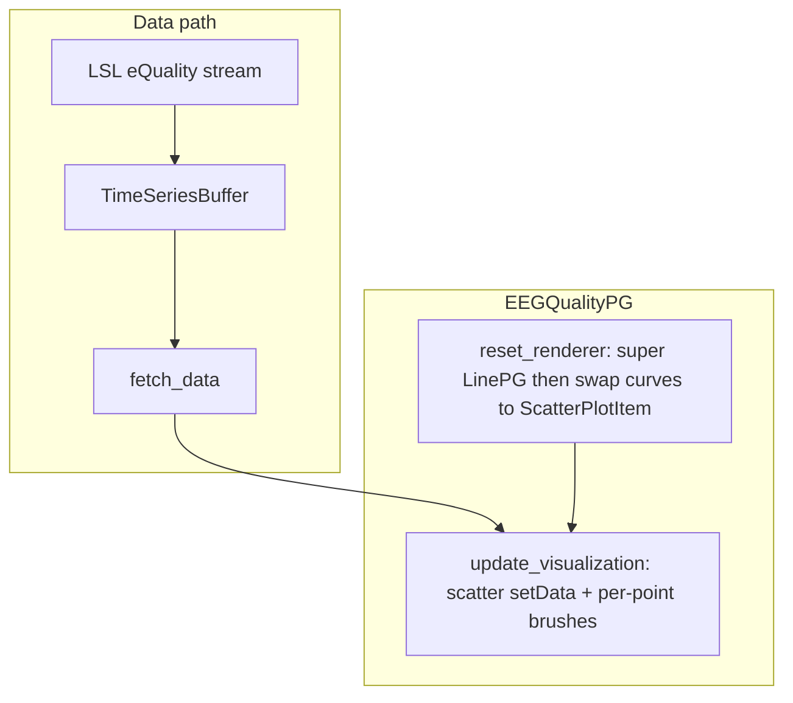

# EEG Quality real-time renderer (stream_viewer)

## Goal

Expose **Epoc X eQuality** (and similar multi-channel quality streams) in stream_viewer as stacked lane circles—red/orange/yellow/green by value 1–4—matching [`EEGQualityCircleDetailRenderer`](c:\Users\pho\repos\EmotivEpoc\ACTIVE_DEV\pyPhoTimeline\pypho_timeline\rendering\detail_renderers\generic_plot_renderer.py) (lines 548–639). **Circles only** (no timeline channel-label strips / grid lines).

## Why subclass `LinePG` (not duplicate it)

[`LinePG`](c:\Users\pho\repos\EmotivEpoc\ACTIVE_DEV\stream_viewer\stream_viewer\renderers\line_pg.py) already implements what we need for live LSL viewing:

- `GraphicsLayoutWidget` per data source
- Stacked lanes via `offset_channels` + y-axis channel ticks (`setYRange(-0.5, n_vis - 0.5)`)
- Sweep/scroll time axis (`ts % duration`)
- `TimeSeriesControl` compatibility

Quality data should **not** use line plotting or y-auto-scaling of sample values; only **x = time**, **y = lane index**, **color = quality**. Subclassing avoids touching `line_pg.py` while reusing axis setup.



## Implementation

### 1. New file: [`stream_viewer/renderers/eeg_quality_pg.py`](c:\Users\pho\repos\EmotivEpoc\ACTIVE_DEV\stream_viewer\stream_viewer\renderers\eeg_quality_pg.py)

**Class:** `EEGQualityPG(LinePG)`

**Defaults** (set in `__init__`, passed to `super()`):

| Parameter | Value | Reason |
|-----------|-------|--------|
| `offset_channels` | `True` | Stacked lanes (required) |
| `auto_scale` | `'none'` | Values 1–4 must not be scaled into y positions |
| `show_chan_labels` | `True` | Y-axis channel names (LinePG ticks) |
| `antialias` | `False` | Avoid legacy `pw.curves` index offset |
| `line_width` | `0` | Curves are removed immediately anyway |

**New `gui_kwargs` entry:** `marker_size=float` (default `8.0`, same as timeline).

**Port from timeline (copy, do not import pyPhoTimeline):**

- Brush colors and `_quality_value_to_brush(value)` thresholds: `<=1` red, `<=2` orange, `<=3` yellow, else green; gray for NaN/invalid
- `pg.mkPen('#202020', width=0.5)` symbol pen
- `ScatterPlotItem(..., symbol='o', pxMode=True)`

**`reset_renderer`:**

1. Call `super().reset_renderer(...)` to build plot layout, y-ticks, labels, x-linking.
2. Call private `_replace_curves_with_scatters()`:
   - For each source `src_ix`, `pw = self._widget.getItem(src_ix, 0)` (same indexing as `LinePG.update_visualization`)
   - Remove each `PlotCurveItem` in `pw.curves`
   - Create one `pg.ScatterPlotItem` per visible channel (preserve channel order from `ch_states`)
   - Store in `self._scatter_items: List[List[pg.ScatterPlotItem]]` aligned with `src_ix`

**`update_visualization`:** **Do not call** `super()` (parent expects `pw.curves` and would scale quality values into y-coordinates).

Per source (mirror `LinePG` loop structure):

1. Early exit if no timestamps (same guard as LinePG).
2. `sync_y_axes()` if `self._do_yaxis_sync`.
3. For each visible channel `ch_ix`:
   - `y_lane = float(ch_ix)` (matches `curve.setPos(0, ch_offset_row)` in LinePG)
   - `x = ts % self.duration`
   - Mask finite `(x, value)` pairs from buffer row `dat[ch_ix]`
   - `brush = [_quality_value_to_brush(v) for v in values]`
   - `scatter.setData(x=x, y=np.full(n, y_lane), brush=brush)`

Skip LinePG marker/text handling unless you later need markers on quality streams (eQuality is numeric only).

**Property:** `marker_size` setter triggers `reset_renderer(reset_channel_labels=False)` (same pattern as `line_width` on LinePG).

### 2. Register renderer: [`stream_viewer/renderers/__init__.py`](c:\Users\pho\repos\EmotivEpoc\ACTIVE_DEV\stream_viewer\stream_viewer\renderers\__init__.py)

Add:

```python
from stream_viewer.renderers.eeg_quality_pg import EEGQualityPG
```

This makes `EEGQualityPG` appear in `list_renderers()` and the main app renderer dropdown (same discovery path as `LinePowerVis`).

### 3. Files intentionally unchanged

- [`line_pg.py`](c:\Users\pho\repos\EmotivEpoc\ACTIVE_DEV\stream_viewer\stream_viewer\renderers\line_pg.py) — zero edits
- pyPhoTimeline — no cross-package dependency
- No notebook changes

## Usage (manual test)

1. Start stream_viewer with an LSL **Epoc X eQuality** stream (`RAW` type, name contains ` eQuality` per [`_is_eeg_quality_stream`](c:\Users\pho\repos\EmotivEpoc\ACTIVE_DEV\PhoPyMNEHelper\src\phopymnehelper\xdf_files.py)).
2. Select renderer **EEGQualityPG** (instead of LinePG).
3. Confirm: one row per source, channel names on y-axis, colored circles advancing in sweep/scroll time, colors track quality 1–4.

## Risk notes

- **Source/row indexing:** Inherits existing `LinePG` behavior (`getItem(src_ix, 0)`); if a source has zero visible channels, behavior matches LinePG today.
- **Performance:** eQuality is low rate (~2 Hz × ~32 ch × buffer duration); per-frame `setData` with brush lists is acceptable.
- **Auto-scale in UI:** If user switches control panel to By-Channel/By-Stream, `fetch_data` would scale values before render—keep default `none` and document that quality mode expects raw 1–4 values.

## Optional follow-up (out of scope)

- Channel label color strips + horizontal grid (timeline plan)
- Unit test for `_quality_value_to_brush` boundary values (1, 2, 3, 4, NaN)
