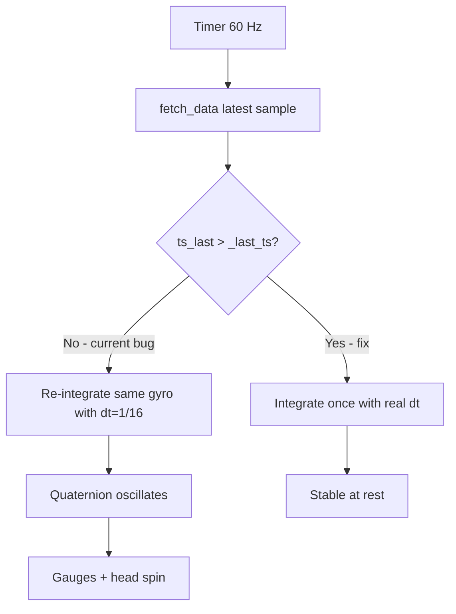

# Fix MotionOrientation3D periodic spin at rest

## Root cause

The renderer timer runs at **~60 Hz** ([`PyVistaRenderer.restart_timer`](c:\Users\pho\repos\EmotivEpoc\ACTIVE_DEV\stream_viewer\stream_viewer\renderers\display\pyvista.py)), while Emotiv motion streams arrive at **~16 Hz**. Each timer tick calls `update_visualization`, which always reads the latest buffered sample and calls `MotionData.update_quaternion`.

The critical bug is in [`update_visualization`](c:\Users\pho\repos\EmotivEpoc\ACTIVE_DEV\stream_viewer\stream_viewer\renderers\motion_orientation_3d.py):

```253:257:stream_viewer/renderers/motion_orientation_3d.py
        if self._last_ts is None:
            dt = 1.0 / srate
        else:
            dt = max(float(ts_last - self._last_ts), 1.0 / srate)
        self._last_ts = ts_last
```

When **no new sample** has arrived since the last tick, `ts_last == _last_ts`, so `dt` falls back to `1/srate` (62.5 ms) anyway. The same gyro/accel vector is integrated **~3.75 times per real sample period**. That over-integrates gyro noise into rotation, then the Madgwick accelerometer correction pulls it back — producing the **periodic oscillation** you see on all three gauges and the 3D head.



The batch offline path in [`MotionData.compute_quaternions`](c:\Users\pho\repos\EmotivEpoc\ACTIVE_DEV\PhoPyMNEHelper\src\phopymnehelper\motion_data.py) does **not** have this bug — it only advances when `i > 0` and uses actual inter-sample `dt`.

## Fix (primary)

**File:** [`stream_viewer/renderers/motion_orientation_3d.py`](c:\Users\pho\repos\EmotivEpoc\ACTIVE_DEV\stream_viewer\stream_viewer\renderers\motion_orientation_3d.py)

### 1. Skip duplicate timestamps

Early-return when `ts_last <= self._last_ts` (use a small epsilon, e.g. `1e-9`, for float safety). Do **not** update `_last_ts` or quaternion on duplicate frames.

### 2. Process all new samples since last fusion (recommended)

Replace `_latest_motion_sample`-only logic with a helper that walks the motion buffer columns whose timestamps are **newer than `_last_ts`**, fusing each `(sample, dt)` in order — matching `compute_quaternions` semantics and handling catch-up after UI lag:

- First sample after reset: `dt = 1.0 / srate`
- Subsequent samples: `dt = ts[i] - ts[i-1]`, clamped to a reasonable minimum (e.g. `1/srate`) and maximum (e.g. 0.5 s) to guard timestamp gaps
- After the loop, set `_last_ts` to the last processed timestamp
- Update mesh/gauges **once** after all samples in the batch

Sketch:

```python
def _iter_new_motion_samples(self, collect_data, collect_timestamps):
    # yield (sample, dt) for each unprocessed column in motion buffer
    ...

def update_visualization(...):
    ...
    batch = list(self._iter_new_motion_samples(...))
    if not batch:
        return
    for sample, dt in batch:
        self._q = MotionData.update_quaternion(self._q, gyro_deg_s=..., acc_g=..., dt=dt, beta=...)
    # then update mesh + gauges once
```

### 3. Unwrap euler angles for gauge display (secondary, defensive)

Even after the fusion fix, euler decomposition from scipy returns `[-180, 180]` and can jump near boundaries during real movement. Track `_prev_yaw/_prev_pitch/_prev_roll` and adjust each new angle by ±360° to minimize delta before calling `set_angle_degrees`. Small helper in the renderer or on `AxisGaugeWidget.set_angle_degrees_unwrapped`.

## What we are NOT changing

- **Madgwick `beta`**, axis sequence, or head-mesh frame — not the cause of periodic spin at rest; tune separately if gauges don't match EMOTIVPRO after fix
- **PhoPyMNEHelper `update_quaternion`** — logic is correct; caller was misusing it
- **Timer rate** — 60 Hz is fine for smooth mesh rendering once fusion is gated on new samples

## Verification

1. Connect Epoc X Motion stream, select **MotionOrientation3D**, place headset flat and still
2. Confirm gauges and head mesh stay **stable** (no periodic rotation)
3. Rotate headset on each axis — gauges and mesh should track smoothly without runaway drift
4. Optional: log `ts_last`, `_last_ts`, and `dt` briefly to confirm fusion runs ~16 Hz, not 60 Hz

## Files touched

| File | Change |
|------|--------|
| [`motion_orientation_3d.py`](c:\Users\pho\repos\EmotivEpoc\ACTIVE_DEV\stream_viewer\stream_viewer\renderers\motion_orientation_3d.py) | Gate fusion on new timestamps; iterate new samples; optional euler unwrap state |
| [`axis_gauge_widget.py`](c:\Users\pho\repos\EmotivEpoc\ACTIVE_DEV\stream_viewer\stream_viewer\widgets\axis_gauge_widget.py) | Optional: `set_angle_degrees_unwrapped(prev)` helper |
