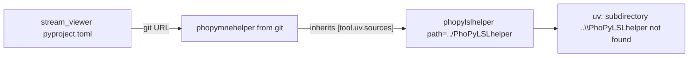

# Fix phopylslhelper git resolution failure

## Root cause



- [`stream_viewer/pyproject.toml`](c:\Users\pho\repos\EmotivEpoc\ACTIVE_DEV\stream_viewer\pyproject.toml) pins `phopymnehelper` to git (`CommanderPho/PhoPyMNEHelper`).
- The **published** [`PhoPyMNEHelper/pyproject.toml`](c:\Users\pho\repos\EmotivEpoc\ACTIVE_DEV\PhoPyMNEHelper\pyproject.toml) is in **dev mode** and declares:
  ```toml
  phopylslhelper = { path = "../PhoPyLSLhelper", editable = true }
  ```
- When uv fetches `phopymnehelper` from git, it tries to resolve that relative path **inside the git checkout**, producing the bogus URL:
  `git+https://github.com/CommanderPho/PhoPyMNEHelper.git#subdirectory=..\PhoPyLSLhelper`
- uv allows the **root project** to override transitive `[tool.uv.sources]`, but [`stream_viewer/templating/pyproject_template_release.toml_fragment`](c:\Users\pho\repos\EmotivEpoc\ACTIVE_DEV\stream_viewer\templating\pyproject_template_release.toml_fragment) is missing `phopylslhelper`.
- [`pyPhoTimeline`](c:\Users\pho\repos\EmotivEpoc\ACTIVE_DEV\pyPhoTimeline\templating\pyproject_template_release.toml_fragment) already includes both — that is the correct pattern.

**Correct git remote** (verified locally): `https://github.com/CommanderPho/phopylslhelper.git` (lowercase repo name).

## Fix strategy (3 layers)

### Layer 1 — Immediate fix: stream_viewer

Update release template to add transitive override (before `phopymnehelper` line):

```toml
[tool.uv.sources]
phopylslhelper = { git = "https://github.com/CommanderPho/phopylslhelper.git" }
phopymnehelper = { git = "https://github.com/CommanderPho/PhoPyMNEHelper.git" }
phopyqthelper = { git = "https://github.com/CommanderPho/phopyqthelper.git" }
```

Then apply and re-lock:

```bash
cd stream_viewer
uv-deps-switcher release --yes   # merges template into pyproject.toml
uv lock
uv run lsl_viewer                  # verify
```

Dev template is already correct (local `../PhoPyMNEHelper`); verify dev mode:

```bash
uv-deps-switcher dev --yes
uv lock
uv run lsl_viewer
```

### Layer 2 — Systemic fix: uv-deps-switcher templates

In [`uv-deps-switcher/src/uv_deps_switcher/main.py`](c:\Users\pho\repos\EmotivEpoc\ACTIVE_DEV\uv-deps-switcher\src\uv_deps_switcher\main.py):

- Add a small transitive-override map:
  ```python
  TRANSITIVE_SOURCE_OVERRIDES = {
      "phopymnehelper": ["phopylslhelper"],
  }
  ```
- Add `expand_include_deps(deps) -> Set[str]` that unions transitive deps before template generation.
- Call it from `deploy_templates()` so `deploy-templates` auto-includes `phopylslhelper` when a project depends on `phopymnehelper`.

In [`pyproject_template_release.toml_fragment.j2`](c:\Users\pho\repos\EmotivEpoc\ACTIVE_DEV\uv-deps-switcher\src\uv_deps_switcher\templates\pyproject_template_release.toml_fragment.j2):

- Change the `phopylslhelper` block condition from:
  ``
  to also fire when `phopymnehelper` is present (belt-and-suspenders with Python expansion).
- Consider parameterizing git URLs via `resolve_github_username(project_path)` instead of hardcoded `PhoPersonalOrg` (currently mismatched with your `CommanderPho` remotes). At minimum, document that `deploy-templates` on each repo will infer correct URLs from local git remotes when re-deploying per-repo fragments.

Add test in [`tests/test_deploy_templates.py`](c:\Users\pho\repos\EmotivEpoc\ACTIVE_DEV\uv-deps-switcher\tests\test_deploy_templates.py):

- Project with only `phopymnehelper` as direct dep → generated release template includes `phopylslhelper`.

Update [`README.md`](c:\Users\pho\repos\EmotivEpoc\ACTIVE_DEV\uv-deps-switcher\README.md) with a short "Transitive source overrides" section explaining why `phopymnehelper` release mode requires `phopylslhelper`.

### Layer 3 — Upstream fix: PhoPyMNEHelper

The **committed** [`PhoPyMNEHelper/pyproject.toml`](c:\Users\pho\repos\EmotivEpoc\ACTIVE_DEV\PhoPyMNEHelper\pyproject.toml) on GitHub should be in **release mode** (git URL for `phopylslhelper`), not dev paths. Local dev work uses `uv-deps-switcher dev`.

- Run `uv-deps-switcher release` in PhoPyMNEHelper (applies existing [`templating/pyproject_template_release.toml_fragment`](c:\Users\pho\repos\EmotivEpoc\ACTIVE_DEV\PhoPyMNEHelper\templating\pyproject_template_release.toml_fragment))
- Update that release fragment URL from `PhoPersonalOrg` → `CommanderPho/phopylslhelper.git` to match actual remote
- Commit and push PhoPyMNEHelper so future consumers don't rely solely on overrides

**Note:** PhoPyMNEHelper also has `mne = { path = "../../mne-python" }` in dev mode — same class of problem for consumers that don't override `mne`. stream_viewer already overrides `mne` locally; no change needed there.

## Rollout across other repos

Repos in [`stream_viewer/uv-deps-switcher.toml`](c:\Users\pho\repos\EmotivEpoc\ACTIVE_DEV\stream_viewer\uv-deps-switcher.toml) groups:

| Repo | In workspace | Action |
|------|-------------|--------|
| stream_viewer | yes | Fix template + apply release |
| PhoLogToLabStreamingLayer | no | Re-run `deploy-templates` + `release` after uv-deps-switcher update |
| whisper-timestamped | no | Same |
| pyPhoTimeline | yes | Already has override; re-deploy after tool update for consistency |

After uv-deps-switcher changes are installed:

```bash
uv tool install -e ../uv-deps-switcher   # or uv tool upgrade
uv-deps-switcher deploy-templates --group all --yes
uv-deps-switcher release --group all --yes
```

Each affected repo: `uv lock` + smoke test.

## Verification checklist

- `uv run lsl_viewer` succeeds in **release** mode (git deps)
- `uv-deps-switcher dev && uv lock && uv run lsl_viewer` succeeds in **dev** mode (local siblings)
- `deploy-templates` on a project with only `phopymnehelper` generates `phopylslhelper` in release fragment
- No `subdirectory=..\PhoPyLSLhelper` error in uv output
