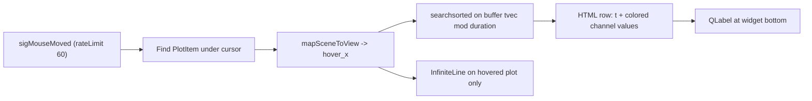

# LinePG value trace tooltip

## Goal

Add a **value trace tooltip** to [`line_pg.py`](c:\Users\pho\repos\EmotivEpoc\ACTIVE_DEV\stream_viewer\stream_viewer\renderers\line_pg.py) that is **enabled by default** and shows channel values at the hovered x-position in a **single horizontal row along the bottom edge**. When multiple data sources are stacked, show **only the channels from the plot under the mouse cursor** (per your choice).

## Reference patterns (reuse, do not import)

Existing hover overlays in pyPhoTimeline follow the same performant recipe:

- [`dose.py`](c:\Users\pho\repos\EmotivEpoc\ACTIVE_DEV\pyPhoTimeline\pypho_timeline\rendering\datasources\specific\dose.py) — `pg.SignalProxy(scene().sigMouseMoved, rateLimit=60)` + `InfiniteLine` + label
- [`track_renderer.py`](c:\Users\pho\repos\EmotivEpoc\ACTIVE_DEV\pyPhoTimeline\pypho_timeline\rendering\graphics\track_renderer.py) — bounds check via `plot_item.sceneBoundingRect().contains(pos)`, hide on leave

Container-widget pattern already used in [`matplotlib.py`](c:\Users\pho\repos\EmotivEpoc\ACTIVE_DEV\stream_viewer\stream_viewer\renderers\display\matplotlib.py) / [`pyvista.py`](c:\Users\pho\repos\EmotivEpoc\ACTIVE_DEV\stream_viewer\stream_viewer\renderers\display\pyvista.py): wrap plot widget + auxiliary QLabel, override `native_widget`.

## Architecture



## Implementation (all in `line_pg.py`)

### 1. New option: `show_value_trace=True`

- Add to `gui_kwargs`: `show_value_trace=bool`
- Add `__init__` kwarg + stored `_show_value_trace`
- Property/setter (setter calls `_setup_value_trace_overlay()` or hides label; no full `reset_renderer` needed unless vLines must be recreated)

### 2. Widget layout: bottom trace row

In `__init__`, after creating `self._widget = pg.GraphicsLayoutWidget()`:

- Create `self._container = QtWidgets.QWidget()` with zero-margin `QVBoxLayout`
- Add `self._widget` (stretch) + `self._trace_label = QtWidgets.QLabel('')` (fixed height, word-wrap off)
- Style label: dark semi-transparent background, small font matching `font_size`, left-aligned, `setTextFormat(RichText)`
- Override `native_widget` to return `self._container` (same pattern as matplotlib/pyvista renderers)

### 3. Overlay state (rebuilt in `reset_renderer`)

New instance fields:

- `_value_trace_proxy` — single `pg.SignalProxy` on `self._widget.scene().sigMouseMoved`
- `_trace_vlines: dict[int, pg.InfiniteLine]` — one vertical line per source row (hidden by default)
- `_trace_channel_meta: dict[int, list[tuple[name, color_hex]]]` — visible channel names + pen colors, built during the existing channel loop in `reset_renderer`
- `_trace_last_key` — cache `(src_ix, quantized_x)` to skip redundant HTML rebuilds

At end of `reset_renderer`:

- Tear down old proxy (`disconnect()`), clear vLines (they are destroyed by `_widget.clear()` anyway)
- If `show_value_trace`: create vLine per plot (`pen=mkPen('#888', width=1, style=QtCore.Qt.DashLine)`, `ignoreBounds=True`, `setZValue(1000)`), build `_trace_channel_meta`, connect proxy

Connect `scene().sigMouseExited` (if available) to hide label + all vLines.

### 4. Mouse handler: `_on_value_trace_mouse_moved(pos)`

1. Iterate source rows (`getItem(row, 0)`), find first plot whose `sceneBoundingRect().contains(pos)` → `src_ix`; if none, hide label + vLines and return
2. `hover_x = float(pw.vb.mapSceneToView(pos).x())`; clamp to `[0, duration]`
3. Hide vLines on non-hovered plots; show + `setPos(hover_x)` on hovered plot's vLine
4. Lookup raw values via `_values_at_display_x(src_ix, hover_x)` (see below)
5. If values found and `(src_ix, round(hover_x, 4)) != _trace_last_key`, format HTML row and `setText`; show label

### 5. Value lookup (performant, always raw)

**Do not read `curve.yData`** — `update_visualization` applies auto-scale offsets and channel stacking transforms there. Raw samples live in the buffer.

```python
def _values_at_display_x(self, src_ix, hover_x):
    buf = self._buffers[src_ix]
    if buf._tvec.size == 0:
        return None
    x_mod = buf._tvec % self.duration
    idx = int(np.searchsorted(x_mod, hover_x))
    # pick nearest of idx-1, idx; handle edges
    vals = buf._data[:, idx]
    return vals  # shape (n_chans,)
```

This is O(log n) per hover and avoids per-frame `fetch_data` / string work when the cursor hasn't moved meaningfully.

### 6. Bottom-row formatting

Single QLabel HTML row, e.g.:

`t=1.234 s` followed by colored spans per visible channel:

`<span style="color:#4fc3f7">AF3: 12.3</span>&nbsp;&nbsp;...`

- Channel order matches `_trace_channel_meta[src_ix]`
- Use `%g` formatting (compact, readable for EEG amplitudes)
- NaN/non-finite → em dash
- Optional unit suffix if all visible channels share one unit (reuse existing `ch_states['unit']` check from `reset_renderer`)

### 7. Lifecycle / edge cases

| Case | Behavior |
|------|----------|
| `reset_renderer` / `_widget.clear()` | Rebuild vLines, meta, proxy |
| Mouse leaves widget | Hide label + vLines |
| `show_value_trace=False` | Hide label, disconnect proxy, skip overlay setup |
| Zero visible channels | Skip overlay for that source |
| `EEGQualityPG` subclass | Inherits tooltip automatically; shows raw 1–4 quality values from buffer |

### 8. Files touched

- **Primary:** [`stream_viewer/renderers/line_pg.py`](c:\Users\pho\repos\EmotivEpoc\ACTIVE_DEV\stream_viewer\stream_viewer\renderers\line_pg.py) — all logic above (~80–100 lines)
- **No changes** to `__init__.py`, `eeg_quality_pg.py`, docs, or notebooks

## Manual test plan

1. Launch [`lsl_linepg.py`](c:\Users\pho\repos\EmotivEpoc\ACTIVE_DEV\stream_viewer\stream_viewer\applications\lsl_linepg.py) with a multi-channel EEG stream
2. Confirm bottom row appears on hover with `t=` prefix and per-channel colored values
3. Confirm vertical dashed line tracks x on the hovered plot only
4. Test with `offset_channels=True/False` and `auto_scale='none'` — values should remain raw buffer units
5. Test with two data sources stacked — bottom row switches when moving between plots
6. Toggle `show_value_trace=False` via renderer settings — row and vLine disappear
7. Smoke-test `EEGQualityPG` — hover shows integer quality values 1–4

## Performance notes

- `SignalProxy` rateLimit=60 caps handler frequency
- `(src_ix, quantized_x)` cache avoids QLabel HTML rebuild on sub-pixel jitter
- Buffer `searchsorted` is the only per-move numpy work; no curve iteration, no `fetch_data` on hover
- vLines are persistent graphics items (not recreated per mouse move)
