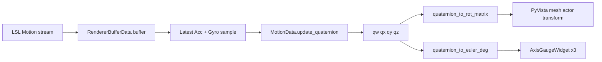

# MotionOrientation3D renderer (stream_viewer)

## Goal

Implement [`MotionOrientation3D`](c:\Users\pho\repos\EmotivEpoc\ACTIVE_DEV\stream_viewer\stream_viewer\renderers\motion_orientation_3d.py) for **live LSL motion streams** (`AccX`–`GyroZ`, 16 Hz per [`modality_channels_dict`](c:\Users\pho\repos\EmotivEpoc\ACTIVE_DEV\PhoPyLSLhelper\src\phopylslhelper\core\data_modalities.py)), matching the EMOTIVPRO layout:

1. **Center:** default head STL (not a cube), rotated from fused orientation  
2. **Bottom row:** three circular gauges — **Rotation (yaw)**, **Roll**, **Pitch** — with static circle/crosshairs and rotating blue/pink indicators

No pyPhoTimeline changes in this pass (per your choice).

## Architecture



## Reuse existing building blocks

| Piece | Source |
|-------|--------|
| Renderer discovery | [`list_renderers()`](c:\Users\pho\repos\EmotivEpoc\ACTIVE_DEV\stream_viewer\stream_viewer\renderers\resolver.py) — inherit `RendererBufferData` + `PyVistaRenderer` |
| PyVista Qt embed | [`TopoMNE.reset_renderer`](c:\Users\pho\repos\EmotivEpoc\ACTIVE_DEV\stream_viewer\stream_viewer\renderers\topo_mne.py) (`BackgroundPlotter`, `interactor` in `_layout`) |
| Default head STL | [`get_simplified_head_mesh_path()`](c:\Users\pho\repos\EmotivEpoc\ACTIVE_DEV\PhoPyMNEHelper\src\phopymnehelper\resources\__init__.py) (same mesh as TopoMNE default) |
| Mesh load/scale/center | Copy `_load_and_prepare_head_mesh()` logic from TopoMNE (~lines 136–159) |
| Live quaternion fusion | [`MotionData.update_quaternion`](c:\Users\pho\repos\EmotivEpoc\ACTIVE_DEV\PhoPyMNEHelper\src\phopymnehelper\motion_data.py) (Madgwick-style; already intended for streaming) |
| Rotation matrix | [`MotionData.quaternion_to_rot_matrix`](c:\Users\pho\repos\EmotivEpoc\ACTIVE_DEV\PhoPyMNEHelper\src\phopymnehelper\motion_data.py) |

## New code (stream_viewer)

### 1. `MotionOrientation3D` renderer

**File:** [`stream_viewer/renderers/motion_orientation_3d.py`](c:\Users\pho\repos\EmotivEpoc\ACTIVE_DEV\stream_viewer\stream_viewer\renderers\motion_orientation_3d.py)

```python
class MotionOrientation3D(RendererBufferData, PyVistaRenderer):
```

**Data mixin settings**

- `auto_scale='none'` — fusion needs raw accel (g) and gyro (deg/s), not normalized buffer values  
- Short `duration` (e.g. 1–2 s) — only the **latest** buffered sample is used each tick  
- `plot_mode='Scrolling'` (or Sweep; either is fine as long as last column is newest)

**State (instance fields)**

- `_q = np.array([1,0,0,0])`, `_last_ts: Optional[float]`  
- `_channel_index: Dict[str, int]` built from `chan_states` on reset (require all six `MOTION` names)  
- `_head_mesh`, `_mesh_actor`, head path defaulting to `get_simplified_head_mesh_path()`

**`reset_renderer`**

- Validate exactly one motion source with required channels; log warning / show plotter text if missing  
- Load head mesh (shared helper or private copy of TopoMNE loader)  
- Layout: `QVBoxLayout` on `_container` — **top:** PyVista `interactor` (stretch 1); **bottom:** `QHBoxLayout` with three gauges (~72–88 px tall)  
- Add mesh actor once; disable axes / use white background to match screenshot  
- Optional: small **nasal landmark** mesh (pink sphere) parented to head transform for the “direction corner” cue (lightweight; skip if mesh frame is unclear)

**`update_visualization`**

1. From `fetch_data()`, take last column of visible channel matrix for the motion source  
2. Map rows → `acc_g`, `gyro_deg_s` via `_channel_index`  
3. `dt = max(ts[-1] - _last_ts, 1/srate)` (fallback `1/16` on first sample); call `MotionData.update_quaternion`  
4. Build 4×4 transform from `quaternion_to_rot_matrix`, apply to `_mesh_actor` via PyVista/VTK user matrix (reset to identity + apply each frame to avoid drift)  
5. `yaw, pitch, roll = quaternion_to_euler_deg(q, sequence='ZYX')` (see PhoPyMNEHelper addition below)  
6. Push angles to the three gauge widgets

**`gui_kwargs`:** `head_mesh_path`, `mesh_opacity`, `madgwick_beta` (pass through to `update_quaternion`)

**Export:** add to [`stream_viewer/renderers/__init__.py`](c:\Users\pho\repos\EmotivEpoc\ACTIVE_DEV\stream_viewer\stream_viewer\renderers\__init__.py) for convenience (auto-discovery already works without it).

### 2. `AxisGaugeWidget` (2D overlay)

**File:** [`stream_viewer/widgets/axis_gauge_widget.py`](c:\Users\pho\repos\EmotivEpoc\ACTIVE_DEV\stream_viewer\stream_viewer\widgets\axis_gauge_widget.py)

Small `QtWidgets.QWidget` with `paintEvent`:

| Variant | Static | Dynamic (angle in degrees) |
|---------|--------|----------------------------|
| `YawGaugeWidget` (“Rotation”) | grey circle + crosshairs | vertical **double arrow** through center (blue up, pink down), rotated by yaw |
| `RollGaugeWidget` | same | horizontal **line** with blue dot right, pink dot left, rotated by roll |
| `PitchGaugeWidget` | same | **diagonal double arrow** (blue / pink), rotated by pitch |

Shared constants: circle pen `#c0c0c0`, label font 9–10 pt grey, blue `#1976d2`, pink `#e91e63`. Expose `set_angle_degrees(float)` → `update()`.

Factory or enum `gauge_kind: Literal['yaw','roll','pitch']` keeps one paint implementation DRY.

### 3. Optional control panel (minimal)

**File:** [`stream_viewer/widgets/motion_orientation_3d_ctrl.py`](c:\Users\pho\repos\EmotivEpoc\ACTIVE_DEV\stream_viewer\stream_viewer\widgets\motion_orientation_3d_ctrl.py)

Mirror [`topo_mne_ctrl.py`](c:\Users\pho\repos\EmotivEpoc\ACTIVE_DEV\stream_viewer\stream_viewer\widgets\topo_mne_ctrl.py): head mesh path browse + beta slider. Set `COMPAT_ICONTROL = ['MotionOrientation3DControlPanel']` only if you want parity with TopoMNE; otherwise defer and rely on `gui_kwargs` / settings ini.

## Small PhoPyMNEHelper addition

**File:** [`phopymnehelper/motion_data.py`](c:\Users\pho\repos\EmotivEpoc\ACTIVE_DEV\PhoPyMNEHelper\src\phopymnehelper\motion_data.py)

Add one classmethod (keeps fusion + display math together):

```python
@classmethod
def quaternion_to_euler_deg(cls, q, sequence='ZYX'):
    from scipy.spatial.transform import Rotation
    # scipy quat order [x,y,z,w]; input q is [w,x,y,z]
    ...
    return yaw, pitch, roll  # names aligned to gauge labels
```

Document that **EMOTIV axis convention may need a fixed offset or sequence tweak** after visual comparison with hardware; expose `euler_sequence` / `euler_offset_deg` on the renderer if first test doesn’t match Pro.

## Coordinate alignment (expect tuning)

- Head STL is centered in TopoMNE **subject/montage** space; Emotiv IMU frame may differ. Plan for a constant `head_mesh_correction_matrix` (or euler offset) applied **before** live rotation — start with identity, tune against a known “looking forward” pose.  
- Reuse TopoMNE mm→m scaling heuristic (`max(abs(points)) > 0.1` → `*= 1e-3`).

## Manual test plan

1. `uv sync --all-extras` in `stream_viewer`  
2. Run `lsl_viewer`, connect **Epoc X Motion** (or any stream with `AccX`…`GyroZ`)  
3. Select renderer **MotionOrientation3D**  
4. Verify head rotates smoothly when moving headset; gauges track yaw/roll/pitch without crashing at 16 Hz  
5. Compare gauge directions to EMOTIVPRO screenshot; adjust euler sequence/offset if inverted

## Out of scope (this PR)

- pyPhoTimeline motion-track / playhead integration  
- Offline `compute_quaternions()` batch path in timeline  
- Replacing `MotionPlotDetailRenderer` line plots

## Files touched (summary)

| Repo | Files |
|------|--------|
| stream_viewer | `renderers/motion_orientation_3d.py` (new), `widgets/axis_gauge_widget.py` (new), optional `widgets/motion_orientation_3d_ctrl.py`, `renderers/__init__.py` |
| PhoPyMNEHelper | `motion_data.py` — `quaternion_to_euler_deg` |
